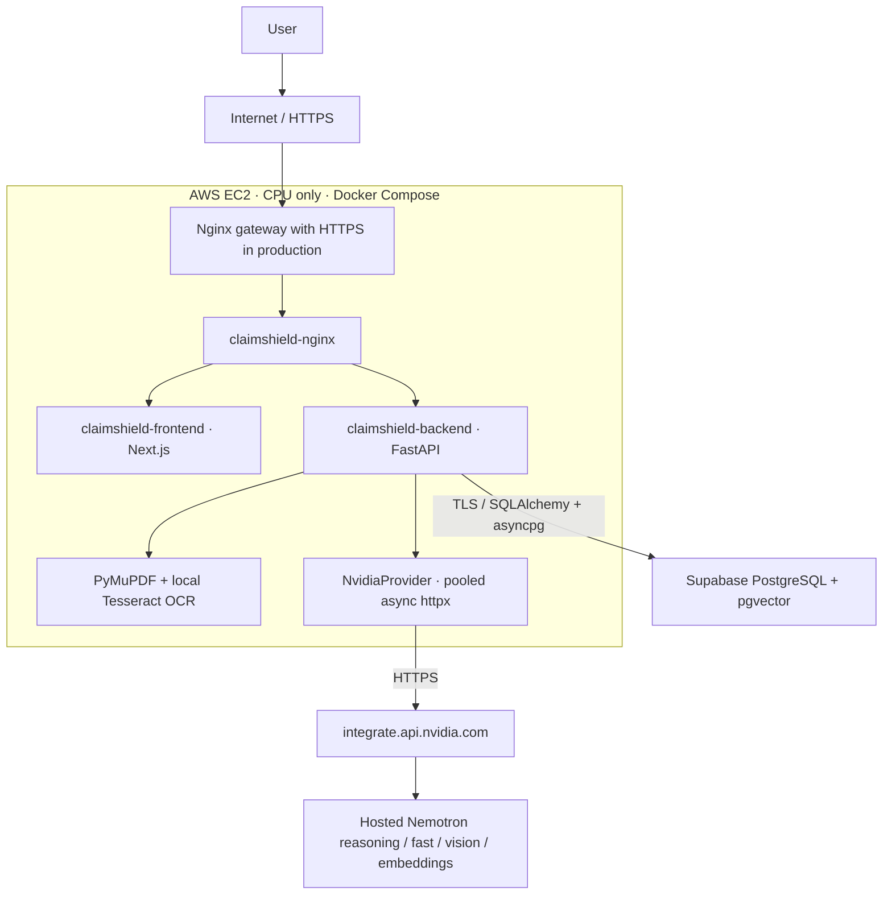
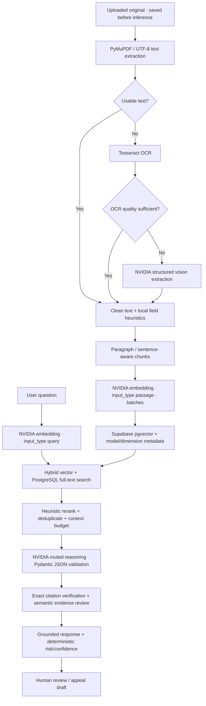

# Architecture and implementation notes

For setup and the user workflow, start with the [README](../README.md). These notes describe the implemented backend and its operational limits.

## Architecture



The default Compose deployment has **three application containers**, using Supabase as the external database.
It does not run a local PostgreSQL container, model server, GPU runtime, or model weights. Redis is not required;
bounded caches and single-flight request deduplication run in the backend process. Use one backend worker.



## NVIDIA AI Setup

1. Create/sign in to an [NVIDIA developer account](https://developer.nvidia.com/).
2. Open [NVIDIA's API/model catalog](https://build.nvidia.com/).
3. Select available hosted/free endpoints, and verify your account has access to each configured model.
4. Generate an [NVIDIA API key](https://build.nvidia.com/settings/api-keys).
5. Add `NVIDIA_API_KEY=...` to the backend `.env`.
6. Configure model IDs, embedding dimension, and any supported model-specific parameters.
7. Start ClaimShield; an admin can run the **Check provider** action in **Provider & usage**.

**Hosted endpoint availability, free quotas, and rate limits are controlled by NVIDIA and may change. Model IDs
are therefore configurable.** A successful `/models` health request verifies reachability/authentication, not access
to every individual model or remaining quota. Check the catalog and run an actual document/analysis workflow.

| Task | Environment configuration | Default model |
| --- | --- | --- |
| Classification, metadata, simple questions, summaries | `NVIDIA_FAST_MODEL` | `nvidia/nemotron-3-nano-omni-30b-a3b-reasoning` |
| Policy, denial, contradictions, synthesis, appeals, orchestration | `NVIDIA_REASONING_MODEL` | `nvidia/nemotron-3-super-120b-a12b` |
| Poor OCR / image understanding | `NVIDIA_VISION_MODEL` | `nvidia/nemotron-3-nano-omni-30b-a3b-reasoning` |
| Passage/query embeddings | `NVIDIA_EMBEDDING_MODEL` | `nvidia/nemotron-3-embed-1b` |
| Optional safety classification | `NVIDIA_SAFETY_MODEL` | Configured by operator, disabled by default |

`NvidiaModelRouter` centralizes selection. `NvidiaProvider` uses `httpx.AsyncClient` connection pooling and low
temperature. Model parameters can be supplied as a JSON mapping in `NVIDIA_MODEL_PARAMETERS`, for example:

```dotenv
NVIDIA_MODEL_PARAMETERS={"nvidia/nemotron-3-super-120b-a12b":{"reasoning_effort":"low","reasoning_budget":4096},"nvidia/nemotron-3-nano-omni-30b-a3b-reasoning":{"reasoning_budget":512}}
```

The example environment uses low-effort Super reasoning with a 4096-token reasoning budget and an 8192-token
total output cap. Live testing showed that an excessively small reasoning budget could leave reasoning prose
in the answer field and fail strict JSON validation. Only use
parameters supported by the selected endpoint. They are not sent to unrelated models. Output tokens
include the model's reasoning allocation; if output is truncated, the provider rejects it and reports the token
limit. Adjust `MAX_OUTPUT_TOKENS` and supported reasoning parameters as appropriate for your model/account.

The generic structured path supplies a JSON schema in the system prompt, parses JSON, validates with Pydantic,
and permits exactly one schema repair request. It does not require provider-native JSON-schema support. Vision
uses base64 image content parts. The provider interface supports future streaming; current user-facing responses
are buffered so evidence checks complete before any conclusions are displayed.

`NVIDIA_REASONING_FALLBACK_MODEL` and `NVIDIA_FAST_FALLBACK_MODEL` are optional. Transient network failures,
timeouts, `429`, `5xx`, and unavailable-model responses use bounded exponential backoff. The configured fallback
is used only after retries are exhausted, with model-specific parameters. Authentication and invalid payload
errors do not trigger failover. The actual model and fallback status appear in usage logs and saved reports.
Pending (`202`) responses are retried within the bounded policy; no arbitrary redirect or polling URL is followed.

The default embedding endpoint accepts **passage** for indexing and **query** for questions. The default model
uses 2048-D output; set `NVIDIA_EMBEDDING_DIMENSION` if choosing another model. Inputs are batched (16 by default),
bounded conservatively below the endpoint's input limit, and vectors are checked for dimension, finiteness,
nonzero values, response index ordering, and count.

API references: [reasoning](https://docs.api.nvidia.com/nim/reference/nvidia-nemotron-3-super-120b-a12b-infer),
[multimodal](https://docs.api.nvidia.com/nim/reference/nvidia-nemotron-3-nano-omni-30b-a3b-reasoning-infer),
[embeddings](https://docs.api.nvidia.com/nim/reference/nvidia-nemotron-3-embed-1b-infer).

## Evidence, caching, and failure behavior

- Originals are written to a persistent Docker volume and database records are committed before inference.
  Provider failures leave claims, originals, previous analyses, login, and human review available.
- Text PDFs use PyMuPDF. Scanned pages/images attempt local Tesseract first. Only poor OCR triggers remote vision.
  AI transcriptions carry explicit warnings and reduced confidence. Corrupt, encrypted, oversized, or empty files
  fail safely. The configurable defaults are 20 MB/file and 50 pages/PDF, plus 50 documents/claim.
- Document checksums deduplicate uploads within a claim. Persisted chunks/embeddings survive restart, and reindexing
  preserves chunk IDs so historical citations stay resolvable. Interrupted jobs become retryable; committed but
  unstarted uploads are scheduled at startup. Failed jobs do not consume quota in a retry loop.
- Response/embedding/query caches are bounded, in-memory, tenant-scoped TTL caches. Concurrent equivalent requests
  share one task. Embedding keys include input mode, model, dimension, and tenant. Errors are never cached.
  Analysis caching persists in PostgreSQL, keyed by claim evidence revision, question/task, and model configuration.
- Retrieval selects candidate passages, reranks vector/full-text/keyword/document-priority scores, removes duplicate
  text, and fits a token budget. Entire document collections are never sent as a reasoning prompt.
- Every finding, recommendation, and appeal paragraph requires existing chunk IDs and exact source quotations.
  A separate semantic review checks conclusions against their quotations and source context. One bounded
  regeneration can correct a rejected draft, followed by the same exact and semantic checks. If explicit,
  valid indexes identify unsupported conclusions in the second draft, those conclusions can be removed.
  The remaining subset must pass a third, independent verification before saving. Such reports are marked
  incomplete, carry a visible warning (also in appeal downloads), and have confidence capped at 49. Empty
  subsets, appeals without retained appeal paragraphs, ambiguous reviewer verdicts, and failed final reviews
  remain rejected. Rejected output is never saved or cached; manual retry makes a fresh inference request.
  These checks reduce unsupported outputs but do not
  replace a human reviewing source documents, especially OCR/vision transcriptions.
- Missing-document/risk rules and the weighted evidence-confidence score are deterministic Python. The confidence
  score describes evidence quality, not approval probability. Workflow statuses never approve or deny a claim.
- Optional safety classification is enabled by `ENABLE_NVIDIA_SAFETY=true` and a configured safety model. Its
  outage does not block the application. Application scope rules, constrained prompts, typed schemas, citation
  verification, semantic review, and human review remain active.

## Admin usage

`AI_USAGE_MODE=quota` is the default; `cost` mode is also accepted. The dashboard shows NVIDIA requests, requests
today/month, token estimates, rate-limit events, failures, per-model distribution, and average latency. Counts
are **HTTP inference attempts**, including retries and structured-output repair/verification calls. Reporting
periods use UTC. Cached results make no inference calls and add no usage events. Dollar cost remains unavailable
until verified pricing data is supplied; no costs are fabricated.

Every inference attempt records provider, actual model, task, timestamp, latency, token counts/estimates,
HTTP status, success, retry count, fallback use, claim/owner IDs, and request ID. Sensitive prompts and document
contents are not stored in usage logs. Evidence and reports remain in their authorized application tables.

Key endpoints (session cookie required except register/login/health):

| Method | Endpoint | Purpose |
| --- | --- | --- |
| POST | `/api/auth/register`, `/api/auth/login`, `/api/auth/logout` | Session lifecycle |
| GET | `/api/auth/me` | Current user |
| GET/POST | `/api/claims` | Browse/create claims |
| GET | `/api/claims/{id}` | Documents + report history |
| POST | `/api/claims/{id}/documents` | Save upload, enqueue extraction/indexing |
| GET | `/api/documents/{id}/download` | Authorized original download |
| GET | `/api/analyses/{id}/appeal/download` | Authorized appeal draft with source quotations |
| POST | `/api/documents/{id}/retry` | Retry/reindex |
| POST | `/api/claims/{id}/analyze`, `/appeal`, `/chat` | Evidence-grounded workflows |
| POST | `/api/claims/{id}/review` | Human review notes/status |
| GET | `/api/admin/providers/nvidia/health` | Lightweight authenticated provider check |
| GET | `/api/admin/usage` | Admin usage aggregates |
| GET | `/api/health` | Database/application readiness, independent of NVIDIA |
